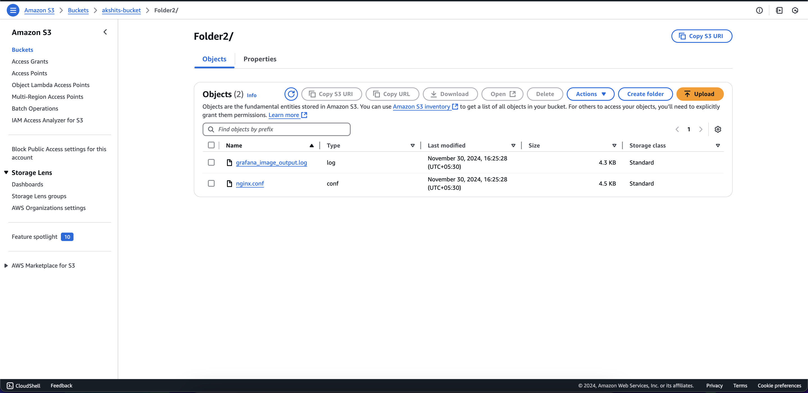

# terraform_infra_s3_list

## Flask App

It uses boto3 SDK to list the objects of a bucket then checks for the content and group then in - Directory and File and then return the output in json.

## Assumption 
1. Code will use the Role of the server to get the permission of S3 bucket.
#### OR
2. Code will use the already configured aws credentials (default) in (~/.aws/credentials).

### Functionality
1. GET /list-bucket-content/: Returns the top-level content of the S3 bucket.
2. GET /list-bucket-content/: Returns the contents of a specific path.
3. If the path does not exist, it returns a Non-existing path message.

### Defined
1. Bucket name is defined - akshits-bucket in config.py file
2. Region is defined - ap-south-1 in config.py file
3. Port 5000

## Terraform

### Assumptions
1. VPC: A VPC must already be created, and the EC2 instance will be launched in this VPC.
2. Public Subnet: A public subnet must exist within the VPC for the EC2 instance to be placed.
3. Key Pair: A pre-existing key pair must be available for SSH access to the EC2 instance.
4. VPC NACL: The Network ACL (NACL) for the VPC must allow inbound and outbound traffic on port 5000 for the application to be accessed externally.

### Resources
The following things will be provisioned by code - 
1. IAM policy for s3 read access.
2. IAM role with s3 polic and ssm policy.
3. Security group to open port 5000 (flask app port) to public.
4. AWS EC2 instance, AMI Id being fetched dynamically with user data that will clone the repo and start the flask app
5. Elastic IP that will be attached to EC2 to access the Instance from internet.

Output will be the Public IP and Public DNS of the EIP through which we can access the app.

# Results

### S3 Bucket Content

### Terraform apply output

### App functionality

